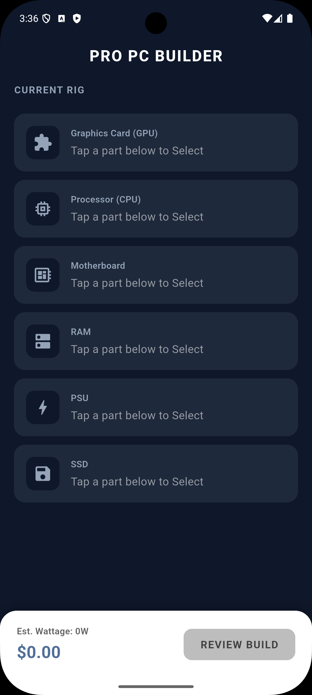
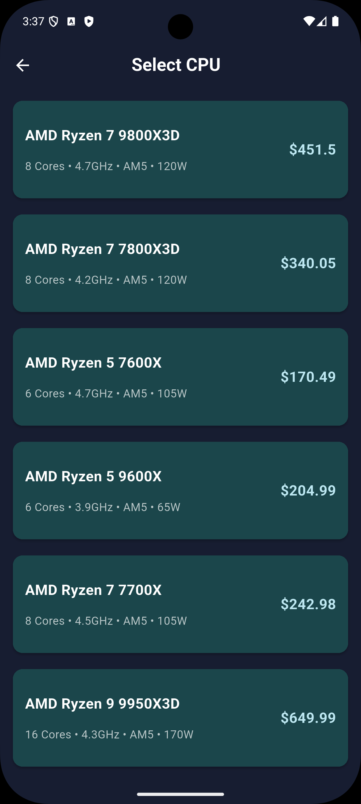
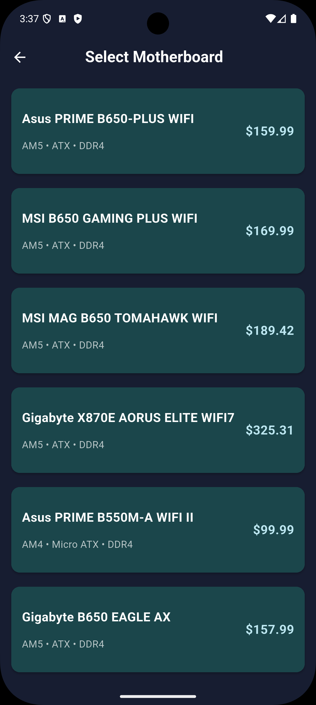
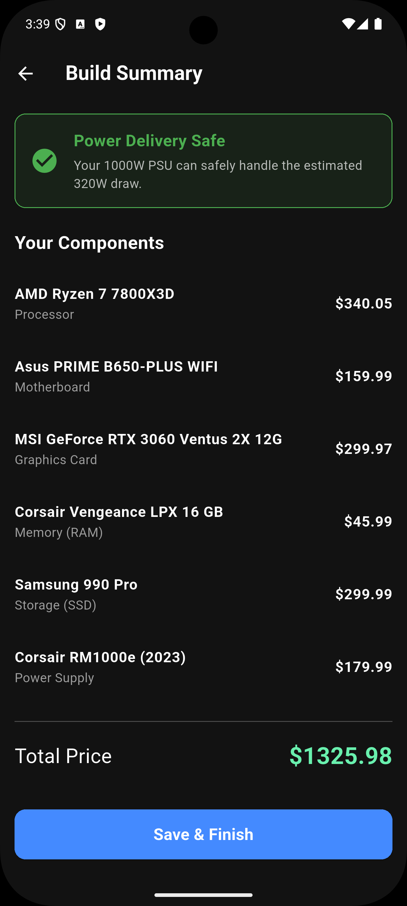

# Pro PC Builder App

## Overview

A comprehensive Flutter application designed for building custom PCs with real-time hardware compatibility validation. This application demonstrates advanced mobile development with complex business logic, immutable state management using BLoC, Clean Architecture principles, and in-memory data management. The app provides intelligent suggestions and prevents incompatible component selections through sophisticated validation algorithms.

## ✨ Key Features

- **Hardware Compatibility Validation** — Real-time validation of CPU, motherboard, GPU compatibility
- **Socket Architecture Detection** — Intelligent detection of processor architectures (Zen 4, Raptor Lake, etc.)
- **Pre-configured Build Templates** — Save and load custom PC builds
- **Component Performance Display** — Show detailed specifications for each component
- **Build Performance Metrics** — Estimate performance tier (Gaming, Streaming, Workstation)
- **Error Prevention System** — Prevent incompatible component combinations with clear error messages
- **Responsive Design** — Optimized UI for all device sizes
- **Clean Architecture** — Repository Pattern with feature-first structure
- **Immutable State Management** — BLoC with copyWith for predictable state transitions

## 📸 Screenshots
### 📸 App Gallery & Validation Logic

<p align="center">
  
  &nbsp;&nbsp;&nbsp;
  
  &nbsp;&nbsp;&nbsp;
  
</p>

<p align="center">
  
  &nbsp;&nbsp;&nbsp;
  
  &nbsp;&nbsp;&nbsp;
  
</p>

<p align="center">
  
  &nbsp;&nbsp;&nbsp;
  
  &nbsp;&nbsp;&nbsp;
  
</p>

### Features Showcase

**Real-Time Compatibility Validation**
1. User selects AMD CPU (Zen 4)
2. System requires AM5 socket motherboard
3. If user selects AM4 motherboard → instant error message
4. Error explains: "Zen 4 CPUs require AM5 socket"
5. User corrects choice → error disappears

**Socket Architecture Detection**
- Zen 4/5 CPUs → AM5 socket required
- Zen 3 and older → AM4 socket
- Raptor Lake/Alder Lake → LGA1700 socket
- Rocket Lake/Comet Lake → LGA1200 socket
- Smart parsing handles variations in naming

**Component Performance Tiers**
- **Entry Level** (Budget gaming)
- **Mid-Tier** (Competitive gaming)
- **High-End** (4K gaming, streaming)
- **Enthusiast** (Professional workloads)

## 🛠 Tech Stack

| Layer | Technology |
|-------|-----------|
| **Frontend Framework** | Flutter 3.0+ |
| **Language** | Dart 3.0+ |
| **State Management** | BLoC (bloc: ^8.0.0) |
| **Architecture** | Clean Architecture with Repository Pattern |
| **Data Storage** | In-Memory (List-based for interview) |
| **Immutability** | Equatable + copyWith pattern |
| **Parser Logic** | String extensions, enums |
| **Version Control** | Git |

## 🏗 Architecture

This project follows **Clean Architecture** with strict layer separation:

```
lib/
├── features/
│   └── pc_builder/
│       ├── data/
│       │   ├── models/
│       │   │   ├── cpu_model.dart
│       │   │   ├── motherboard_model.dart
│       │   │   ├── gpu_model.dart
│       │   │   ├── psu_model.dart
│       │   │   └── ram_model.dart
│       │   ├── datasources/
│       │   │   └── local_hardware_datasource.dart (GitHub data)
│       │   └── repositories/
│       │       └── hardware_repository_impl.dart
│       │
│       ├── domain/
│       │   ├── entities/
│       │   │   ├── cpu_entity.dart
│       │   │   ├── motherboard_entity.dart
│       │   │   ├── gpu_entity.dart
│       │   │   ├── psu_entity.dart
│       │   │   └── ram_entity.dart
│       │   ├── repositories/
│       │   │   └── hardware_repository.dart (interface)
│       │   └── usecases/
│       │       ├── validate_build_usecase.dart
│       │       ├── get_components_usecase.dart
│       │       └── save_build_usecase.dart
│       │
│       └── presentation/
│           ├── bloc/
│           │   ├── builder_event.dart
│           │   ├── builder_state.dart
│           │   └── builder_bloc.dart
│           ├── pages/
│           │   ├── pc_builder_page.dart
│           │   └── component_selection_page.dart
│           └── widgets/
│               ├── component_tile.dart
│               ├── compatibility_error_widget.dart
│               └── build_summary_widget.dart
│
└── core/
    ├── theme/
    ├── extensions/
    │   └── cpu_parser_extension.dart
    └── constants/
        └── socket_types.dart
```

### Layer Responsibilities

**Data Layer** — Manages component data
- Loads component data from GitHub-sourced JSON
- Handles JSON parsing into Dart models
- Provides access to component database

**Domain Layer** — Pure business logic
- Repository interfaces for data access
- Use cases for complex operations
- Entity models (independent of data source)
- Validation rules

**Presentation Layer** — UI and state management
- BLoC for component selection state
- BLoC for build validation state
- Event handling for user interactions
- UI widget composition

## 🚀 Advanced Implementation Highlights

### 1. Socket Architecture Parsing with Extensions

**Problem:** API returns "Zen 4", "zen 4 architecture", "AMD Zen 4" — inconsistent naming

**Solution:** Smart string parser with extension method

```dart
enum CpuSocket {
    am4,
    am5,
    lga1151,
    lga1200,
    lga1700,
    lga1851,
    unknown,
}

extension CpuParser on String {
    CpuSocket toCpuSocket() {
        final value = toLowerCase();
        
        // AMD Ryzen
        if (value.contains('zen 4') || value.contains('zen 5')) {
            return CpuSocket.am5;
        }
        if (value.contains('zen')) {
            return CpuSocket.am4;
        }
        
        // Intel
        if (value.contains('alder lake') || value.contains('raptor lake')) {
            return CpuSocket.lga1700;
        }
        if (value.contains('rocket lake') || value.contains('comet lake')) {
            return CpuSocket.lga1200;
        }
        if (value.contains('coffee lake')) {
            return CpuSocket.lga1151;
        }
        if (value.contains('meteor lake') || value.contains('arrow lake')) {
            return CpuSocket.lga1851;
        }
        
        return CpuSocket.unknown;
    }
}

// Usage
final cpuArchitecture = "AMD Zen 4 Ryzen";
final socket = cpuArchitecture.toCpuSocket();
// Result: CpuSocket.am5 ✅
```

**Result:** Robust parsing handles all variations 🎯

### 2. Compatibility Validation with Error Messages

**Problem:** How to validate complex hardware compatibility rules?

**Solution:** Validation function with descriptive error messages

```dart
String? _validateBuild({
    required Cpu? cpu,
    required Motherboard? motherboard,
    required Gpu? gpu,
    required Psu? psu,
    required Ram? ram,
}) {
    // CPU and Motherboard socket compatibility
    if (cpu != null && motherboard != null) {
        if (cpu.socket != motherboard.socket) {
            return "CPU socket mismatch: ${cpu.socket} CPU requires "
                   "${cpu.socket} socket motherboard. "
                   "Selected motherboard has ${motherboard.socket} socket.";
        }
    }
    
    // PSU power requirements
    if (cpu != null && gpu != null && psu != null) {
        final totalPower = cpu.tdp + gpu.tdp;
        final recommendedPsu = totalPower * 1.25; // 25% headroom
        
        if (psu.wattage < recommendedPsu) {
            return "Insufficient PSU wattage. Build requires $recommendedPsu W, "
                   "but you selected ${psu.wattage} W PSU. "
                   "Recommended: ${recommendedPsu.toStringAsFixed(0)} W or higher.";
        }
    }
    
    // RAM compatibility
    if (motherboard != null && ram != null) {
        if (!motherboard.supportedRamTypes.contains(ram.type)) {
            return "RAM incompatible. Your motherboard supports "
                   "${motherboard.supportedRamTypes.join(', ')}, "
                   "but you selected ${ram.type} RAM.";
        }
    }
    
    return null; // No errors
}
```

**Result:** User gets clear, actionable error messages 💡

### 3. Immutable State with copyWith Pattern

**Problem:** State changes accidentally mutate previous state

**Solution:** Immutable states with copyWith

```dart
class BuilderLoaded extends BuilderState {
    final Cpu? selectedCpu;
    final Motherboard? selectedMotherboard;
    final Gpu? selectedGpu;
    final Psu? selectedPsu;
    final Ram? selectedRam;
    final String? compatibilityError;
    
    const BuilderLoaded({
        this.selectedCpu,
        this.selectedMotherboard,
        this.selectedGpu,
        this.selectedPsu,
        this.selectedRam,
        this.compatibilityError,
    });
    
    // Create new state with only changed fields
    BuilderLoaded copyWith({
        Cpu? selectedCpu,
        Motherboard? selectedMotherboard,
        Gpu? selectedGpu,
        Psu? selectedPsu,
        Ram? selectedRam,
        String? compatibilityError,
    }) {
        return BuilderLoaded(
            selectedCpu: selectedCpu ?? this.selectedCpu,
            selectedMotherboard: selectedMotherboard ?? this.selectedMotherboard,
            selectedGpu: selectedGpu ?? this.selectedGpu,
            selectedPsu: selectedPsu ?? this.selectedPsu,
            selectedRam: selectedRam ?? this.selectedRam,
            compatibilityError: compatibilityError ?? this.compatibilityError,
        );
    }
}

// Usage in BLoC
on<SelectMotherboard>((event, emit) async {
    if (state is BuilderLoaded) {
        final currentState = state as BuilderLoaded;
        
        final error = _validateBuild(
            cpu: currentState.selectedCpu,
            motherboard: event.motherboard,
            // ... other components
        );
        
        // Only changed field is selected motherboard
        emit(currentState.copyWith(
            selectedMotherboard: event.motherboard,
            compatibilityError: error,
        ));
    }
});
```

**Result:** State mutations are safe and predictable 🔒

### 4. BLoC Event and State Structure

**Problem:** How to organize component selection logic?

**Solution:** Clear event→state flow

```dart
// Events
abstract class BuilderEvent {}

class SelectCpu extends BuilderEvent {
    final Cpu cpu;
    SelectCpu(this.cpu);
}

class SelectMotherboard extends BuilderEvent {
    final Motherboard motherboard;
    SelectMotherboard(this.motherboard);
}

class SelectGpu extends BuilderEvent {
    final Gpu gpu;
    SelectGpu(this.gpu);
}

class SelectPsu extends BuilderEvent {
    final Psu psu;
    SelectPsu(this.psu);
}

class SelectRam extends BuilderEvent {
    final Ram ram;
    SelectRam(this.ram);
}

class SaveBuild extends BuilderEvent {
    final String buildName;
    SaveBuild(this.buildName);
}

// States
abstract class BuilderState {}

class BuilderInitial extends BuilderState {}

class BuilderLoading extends BuilderState {}

class BuilderLoaded extends BuilderState {
    final Cpu? selectedCpu;
    final Motherboard? selectedMotherboard;
    final Gpu? selectedGpu;
    final Psu? selectedPsu;
    final Ram? selectedRam;
    final String? compatibilityError;
    
    BuilderLoaded({
        this.selectedCpu,
        this.selectedMotherboard,
        this.selectedGpu,
        this.selectedPsu,
        this.selectedRam,
        this.compatibilityError,
    });
    
    // Copy with implementation
}

class BuildError extends BuilderState {
    final String message;
    BuildError(this.message);
}
```

**Flow:**
```
User selects CPU
    ↓
SelectCpu event fired
    ↓
BLoC validates
    ↓
BuilderLoaded state emitted (with error if invalid)
    ↓
UI updates automatically
```

## 📊 Component Data Structure

### Component Models

```dart
class Cpu {
    final String id;
    final String name;
    final String brand; // AMD, Intel
    final String architecture; // Zen 4, Raptor Lake
    final CpuSocket socket;
    final int cores;
    final int threads;
    final double baseClockGhz;
    final double boostClockGhz;
    final int tdp; // Thermal Design Power in watts
    final double price;
}

class Motherboard {
    final String id;
    final String name;
    final String brand;
    final CpuSocket socket;
    final List<String> supportedRamTypes; // DDR4, DDR5
    final int maxRamCapacityGb;
    final int ramSlots;
    final double price;
}

class Gpu {
    final String id;
    final String name;
    final String brand; // Nvidia, AMD
    final String architecture; // RTX 40 series, RDNA 3
    final int memoryGb;
    final String memoryType; // GDDR6X, GDDR6
    final int tdp;
    final double price;
    final String performanceTier; // Gaming, Professional
}

class Psu {
    final String id;
    final String name;
    final String brand;
    final int wattage;
    final String efficiency; // 80+, 80+ Gold
    final double price;
}

class Ram {
    final String id;
    final String name;
    final String brand;
    final String type; // DDR4, DDR5
    final int capacityGb;
    final int speedMhz;
    final double price;
}
```

## 🎯 How to Run

### Prerequisites
- Flutter 3.0 or higher
- Dart 3.0 or higher
- Android Studio or VS Code
- Internet connection (initial data load)

### Installation Steps

**1. Clone the repository**
```bash
git clone https://github.com/rohitchaudhary3147/pc-builder.git
cd pc-builder
```

**2. Install dependencies**
```bash
flutter pub get
```

**3. Prepare hardware data**

The app uses in-memory data sourced from GitHub files. Create `lib/data/datasources/hardware_data.dart`:

```dart
// This file contains hardware component data
// Initially sourced from GitHub, loaded into memory
final cpuList = [
    Cpu(
        id: 'cpu_001',
        name: 'Ryzen 7 7700X3D',
        brand: 'AMD',
        architecture: 'Zen 4',
        socket: CpuSocket.am5,
        // ... other properties
    ),
    // ... more CPUs
];

final motherboardList = [
    Motherboard(
        id: 'mb_001',
        name: 'ROG Strix X870-E',
        brand: 'Asus',
        socket: CpuSocket.am5,
        // ... other properties
    ),
    // ... more motherboards
];
// ... GPU, PSU, RAM data
```

**4. Run the app**
```bash
flutter run
```

### Run on Specific Device
```bash
flutter run -d emulator-5554  # Android
flutter run -d iphone         # iOS
flutter run -d chrome         # Web
```

## 🔍 Validation Rules

### CPU-Motherboard Compatibility
```
Zen 4/5 (AMD) → AM5 socket required
Zen 3 (AMD) → AM4 socket required
Raptor Lake/Alder Lake (Intel) → LGA1700 socket
Rocket Lake/Comet Lake (Intel) → LGA1200 socket
```

### PSU Power Requirements
```
Recommended = (CPU TDP + GPU TDP) × 1.25
(25% headroom for stability)

Example:
CPU: 105W, GPU: 320W
Recommended PSU: (105 + 320) × 1.25 = 531.25W
Minimum recommended: 550W
```

### RAM Compatibility
```
Motherboard specifies supported types: DDR4 or DDR5
Selected RAM must match motherboard support
```

## 📈 Performance Tiers

Build is classified based on components:

| Tier | GPU | Use Case |
|------|-----|----------|
| **Entry** | GTX 1650 / RX 6600 | Casual gaming, office work |
| **Mid** | RTX 4060 Ti / RX 6700 XT | 1440p gaming, content creation |
| **High** | RTX 4080 / RX 7900 XTX | 4K gaming, streaming |
| **Extreme** | RTX 4090 / RX 7900 XTX | Professional workloads |

## 🎓 Learning Outcomes

This project demonstrates:

✅ **Extension Methods** — Smart string parsing with extensions
✅ **Enum Usage** — Type-safe socket and component types
✅ **Validation Logic** — Complex business rules enforcement
✅ **State Management** — BLoC with immutable copyWith pattern
✅ **Clean Architecture** — Repository Pattern with clear layers
✅ **In-Memory Data** — Efficient local data management
✅ **Error Handling** — User-friendly validation error messages
✅ **Immutability** — Safe state transitions without mutations

## 🚦 Future Enhancements

- [ ] Save builds to local storage (Hive/SQLite)
- [ ] Cloud backup of builds (Firebase)
- [ ] Price tracking from e-commerce APIs
- [ ] Real-time price updates
- [ ] Build export to PDF/JSON format
- [ ] Shareable build links
- [ ] Community builds (trending, popular)
- [ ] Component availability checking
- [ ] Performance benchmarking
- [ ] AI-powered build recommendations

## 📚 Key Dependencies

```yaml
flutter_bloc: ^8.0.0              # State management
equatable: ^2.0.5                 # Value equality
uuid: ^4.0.0                      # Generate unique IDs
```

## 🤝 Code Quality Standards

- **Null Safety** — 100% null-safe code
- **Architecture** — Clean Architecture with Repository Pattern
- **Naming** — Clear, descriptive variable names
- **Comments** — Self-documenting code with helpful comments
- **Error Handling** — Comprehensive validation with user feedback
- **Immutability** — All state changes use copyWith pattern

## 🔗 Links

- **GitHub Repository** — https://github.com/rohitchaudhary3147/pc-builder
- **BLoC Documentation** — https://bloclibrary.dev
- **Clean Architecture** — https://resocoder.com/flutter-clean-architecture
- **Hardware Data Source** — https://github.com (component specifications)

## 📄 License

This project is open source and available under the MIT License.

## 👨‍💻 Author

**Rohit Chaudhary**
- 📧 Email: rodriguezrohit10@gmail.com
- 🔗 LinkedIn: linkedin.com/in/rohitchaudhary3147
- 🐙 GitHub: github.com/rohitchaudhary3147

---

**⭐ If you find this project helpful, please consider giving it a star!**

Last Updated: April 2026
